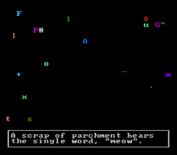

# robotfindskitten for NES

[robotfindskitten](http://robotfindskitten.org/) for the Nintendo
Entertainment System.

[Download ROM](https://github.com/bgilbert/rfknes/releases/download/v1.0.701/robotfindskitten-1.0.701.nes)




## Build requirements

- [64tass](http://tass64.sourceforge.net/)
- C compiler
- Make
- Python 3

## Building

### Standard build (for emulation)

```
make
```

### NROM build (for copying onto a donor cartridge)

This build imposes a limit on the total size of the non-kitten items.

```
make nrom
```
